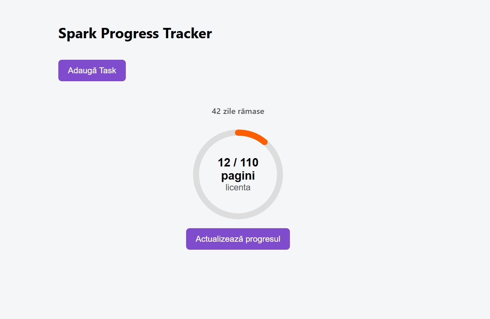
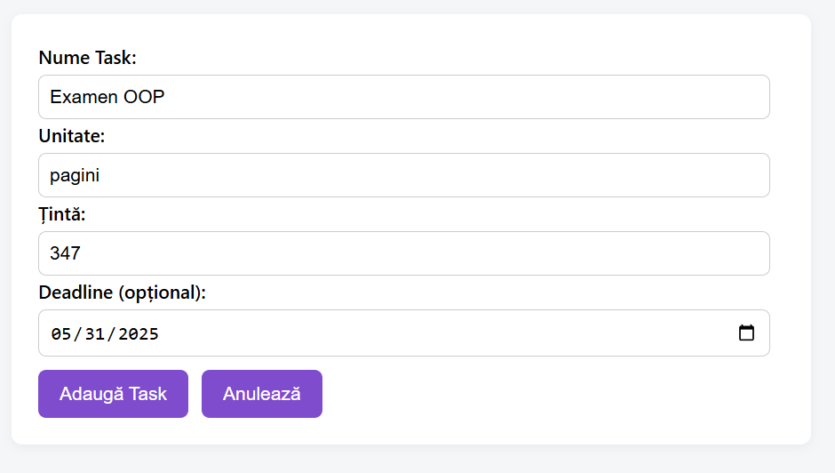
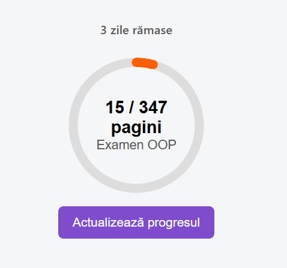
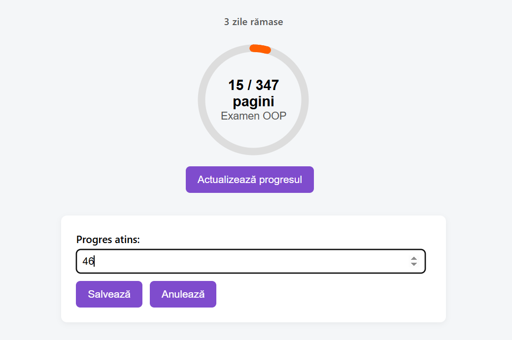
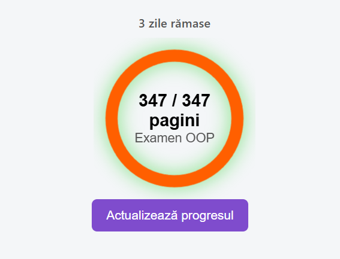

# 🌟 Spark Progress Ring – Visual Progress Tracker Component

Spark Progress Ring is a reusable and visually engaging React component designed to represent the progress of a user-defined task using a circular ring indicator. It is built as part of a lightweight productivity app that allows users to create and track personal goals such as reading books, completing online courses, or preparing for exams.

This component was developed as a final assignment for the **Framework Design** course at UBB, with the goal of demonstrating component encapsulation, interactivity, animation, local persistence, and modular architecture using React and TypeScript.

---

## 🔍 Features

- 📈 **Live progress ring** with SVG animation
- 📆 **Deadline support** with dynamic visual feedback
- ✅ **Single-ring animation** triggered at 100% completion
- 🧾 **Task creation form** with customizable unit (pages, hours, km, etc.)
- 🔁 **Progress update form** (modal-style)
- 💾 **Session-based persistence** using `sessionStorage`
- 🧱 Fully modular: separated logic, view, types, and styles
- 🎨 Modern and minimal UI, styled manually with CSS

---

## 📦 Technologies Used

| Tech                  | Purpose                               |
|-----------------------|---------------------------------------|
| **React**             | UI logic and component rendering      |
| **TypeScript**        | Strong typing and interface control   |
| **date-fns**          | Deadline and date calculations        |
| **CSS**               | UI styling and animation effects      |
| **sessionStorage**    | Client-side caching per session       |

---

## 🧠 Application Structure\
src/
├── components/
│   ├── SparkProgressRing/       # Main visual component
│   │   ├── SparkProgressRing.tsx
│   │   ├── SparkProgressRingView.tsx
│   │   ├── SparkProgressRing.types.ts
│   │   └── SparkProgressRing.css
│   ├── TaskForm/                # Add new task
│   │   └── TaskForm.tsx
│   ├── UpdateProgressForm/     # Update current progress
│   │   └── UpdateProgressForm.tsx
├── App.tsx                      # State logic and integration
├── App.css                      # Global styles

## 🧩 Component API: SparkProgressRing

<SparkProgressRing
  label="Read Book"
  currentValue={80}
  targetValue={100}
  unit="pages"
  deadline="2025-06-01"
  size={180}
  color="#007bff"
/>

## ✨ Visual Feedback & Behavior
The ring fills up proportionally to currentValue / targetValue.

At 100%, a green glow animation is triggered (once only).

Deadline label appears above the ring:

Normal → gray text (e.g., 5 days left)

Overdue → red text (e.g., 3 days overdue)

All updates are reflected in real-time with smooth animations.

## 💡 UX Flow
Click "Add Task"

Fill in: title, unit, goal value, deadline (optional)

Submit → ring is created with 0% progress

Click "Update Progress" under each ring to enter current value

Ring updates; at 100% → visual confirmation (glow pulse)

## 💾 Persistence
Tasks are saved in sessionStorage and automatically reloaded on page refresh.
Data is removed only when the browser/tab is closed.

## 🧪 Example Use Cases
| Use Case                | Description                                     |
|-------------------------|-------------------------------------------------|
| Preparing for exams     | Track study materials progress                  |
| Reading Challenge       | Track how many pages you've read from a book    |
| Online Course Tracker   | Monitor lesson/video completion                 |
| Fitness Log	Progress  | Progress towards a running goal (in km)         |
| Pomodoro Count          | Track completed Pomodoro sessions               |

## 📸 Screenshots

## 📚 License & Acknowledgements
This project was created by Luiza Teodora Rusu as part of the Framework Design course at UBB.
All code is original and created specifically for the course assignment.
No UI libraries were used — all styles are handcrafted.

## 🔮 Future Enhancements
Dark mode toggle

Multiple color choice for progress rings 

Multiple rings per task

Data export (CSV or JSON)

Mobile-friendly layout improvements

Integration with localStorage / Firebase